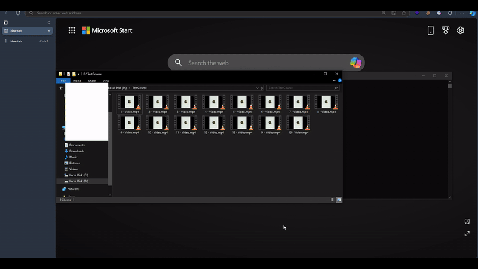

# Videos2Course

Videos2Course is a tool that allows you to create a simple, static webpage course from a set of videos. The generated course includes a progress bar to track completed videos, making it easy for users to follow along and monitor their progress.

## Features
- Generate a static webpage course from a collection of videos
- Track progress with a visual progress bar
- Simple interface

## Demo

